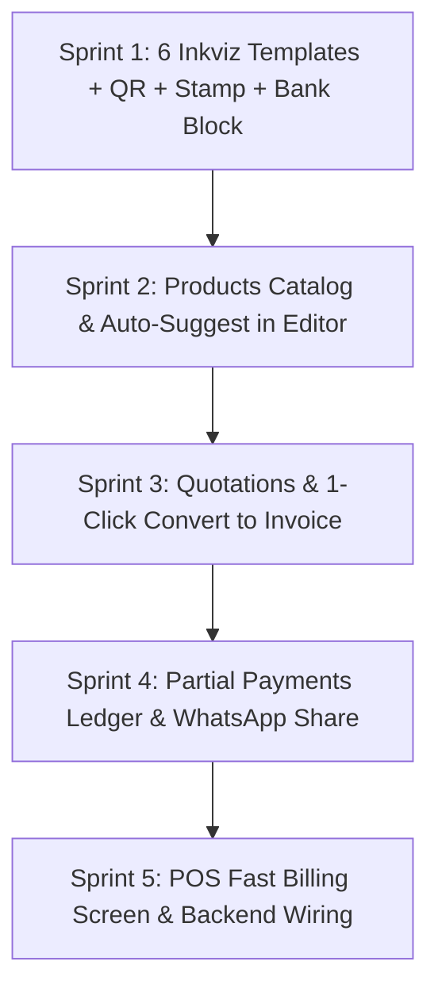

# 🚀 INKVIZ: SaaS-Level Invoicing & Billing Suite — Master Specification & Enhancement Roadmap

> **Target Vision**: Transform Inkviz into an original, enterprise-grade invoicing, sales, and billing operating system.  
> **Target Audience**: Freelancers, Tech Startups, Agencies, Consultants, Retailers, and Modern Enterprises.  
> **Tech Stack**: Next.js 14+ (App Router), Tailwind CSS, Shadcn UI / Radix primitives, Lucide Icons, Express.js (TypeScript), MongoDB Atlas (Mongoose).

---

## 📑 TABLE OF CONTENTS
1. [Core Architectural Blueprint & Navigation](#1-core-architectural-blueprint--navigation)
2. [Module 1: The 6 Original Inkviz Signature Invoice Templates](#2-module-1-the-6-original-inkviz-signature-invoice-templates)
3. [Module 2: Core Document Building Blocks (QR, Stamp, Signature, Bank)](#3-module-2-core-document-building-blocks-qr-stamp-signature-bank)
4. [Module 3: Document Suite & Sales Workflows](#4-module-3-document-suite--sales-workflows)
5. [Module 4: Products, Services & Inventory Catalog](#5-module-4-products-services--inventory-catalog)
6. [Module 5: Customer CRM, Statements & Payment Ledger](#6-module-5-customer-crm-statements--payment-ledger)
7. [Module 6: Expenses, Purchases & Vendor Management](#7-module-6-expenses-purchases--vendor-management)
8. [Module 7: Point of Sale (POS) Fast Billing](#8-module-7-point-of-sale-pos-fast-billing)
9. [Module 8: Distribution, WhatsApp & Client Portal](#9-module-8-distribution-whatsapp--client-portal)
10. [Module 9: Taxation, Multi-Currency & Financial Engine](#10-module-9-taxation-multi-currency--financial-engine)
11. [Module 10: Settings, Branding & Customization](#11-module-10-settings-branding--customization)
12. [Step-by-Step AI Execution Roadmap (Filtered for Solo/AI Dev)](#12-step-by-step-ai-execution-roadmap-filtered-for-soloai-dev)

---

## 1. Core Architectural Blueprint & Navigation

### Modern Collapsible Navigation Hierarchy
```
┌──────────────────────────────────────────────────────────────┐
│ INKVIZ WORKSPACE                                             │
├──────────────────────────────────────────────────────────────┤
│ 📊 Dashboard (Revenue Insights, Cash Flow, Activity Stream)  │
│                                                              │
│ 💼 SALES (Collapsible)                                       │
│   ├── Invoices (/invoices)                                   │
│   ├── Credit Notes (/credit-notes)                           │
│   └── Subscriptions / Recurring (/recurring)                 │
│                                                              │
│ 📝 QUOTATIONS+ (Collapsible)                                 │
│   ├── Estimates & Proposals (/quotations)                    │
│   ├── Proforma Invoices (/proforma)                          │
│   └── Delivery Challans / Packing Slips (/challans)          │
│                                                              │
│ 🛒 PRODUCTS & INVENTORY                                      │
│   ├── Products & Services Catalog (/products)                │
│   └── Stock & Low-Stock Alerts (/inventory)                  │
│                                                              │
│ 👥 CRM                                                       │
│   ├── Customers & Client Ledger (/clients)                   │
│   └── Vendors & Suppliers (/vendors)                         │
│                                                              │
│ 💸 EXPENSES & PURCHASES                                      │
│   ├── Business Expenses (/expenses)                          │
│   └── Purchase Orders (/purchase-orders)                     │
│                                                              │
│ ⚡ QUICK BILLING                                             │
│   └── POS Counter Billing (/pos)                             │
│                                                              │
│ ⚙️ SETTINGS & PREFERENCES                                    │
│   ├── Document & Numbering Settings (/settings)              │
│   ├── Bank Details & UPI QR (/settings)                      │
│   └── Appearance & Theme Colors (/settings)                  │
└──────────────────────────────────────────────────────────────┘
```

---

## 2. Module 1: The 6 Original Inkviz Signature Invoice Templates

Inkviz features **6 exclusive, proprietary invoice layouts** designed specifically for different modern industries, avoiding cliches and third-party copyright conflicts:

```
┌─────────────────┐ ┌─────────────────┐ ┌─────────────────┐
│   INKVIZ APEX   │ │  INKVIZ LUMINA  │ │  INKVIZ NEXUS   │
│  (Executive B2B)│ │(Tech/Design SaaS│ │ (Agencies/Pros) │
├─────────────────┤ ├─────────────────┤ ├─────────────────┤
│ INKVIZ HERITAGE │ │  INKVIZ PRISM   │ │ INKVIZ VELOCITY │
│(Industrial/Tax) │ │(Retail Commerce)│ │(POS Thermal Memo│
└─────────────────┘ └─────────────────┘ └─────────────────┘
```

### 1. `Inkviz Apex` (Executive Corporate & Global B2B)
- **Target Audience**: Corporate enterprises, international suppliers, and high-value B2B contractors.
- **Visual Style**: Sleek slate & platinum geometric hierarchy, refined serif/sans typography pairing, subtle micro-borders.
- **Top Header**: Prominent company branding with multi-state tax ID (GSTIN/VAT/EIN), invoice number badge, and payment terms countdown (*e.g., "Due in 30 Days"*).
- **Address Blocks**: Symmetrical two-column cards with dedicated **"Billing Party"** and **"Consignee / Destination"**.
- **Line Items Table**: Clean matrix showing `#`, `Item & Description`, `Tax / HSN Code`, `Qty`, `Unit Rate`, `Tax %`, and `Net Amount`.
- **Settlement Zone**: Bottom split grid featuring a structured **Bank Wire Card**, **Dynamic Scan-to-Pay QR Code**, and **Corporate Seal Stamp**.

### 2. `Inkviz Lumina` (Tech Startups, SaaS & Creative Studios)
- **Target Audience**: Software companies, digital agencies, UI/UX designers, creators, and modern tech ventures.
- **Visual Style**: Minimalist airy whitespace, bold modern sans typography, customizable glowing brand-color accent bar.
- **Top Header**: Brand logo on top-right, clean left-aligned invoice meta tags (`ORIGINAL INVOICE`, `ID: INV-8921`, `ISSUED: SEPT 2026`).
- **Line Items Table**: Generous row padding, inline SKU badges, sub-descriptions for project scope, and clean discount tags.
- **Settlement Zone**: Floating payment pill with **Scan-to-Pay QR Code**, Stripe/Direct checkout link, and digital e-signature timestamp.

### 3. `Inkviz Nexus` (Consultants, Legal, Freelancers & Service Pros)
- **Target Audience**: Lawyers, accountants, business consultants, fractional executives, and freelancers.
- **Visual Style**: Elegant editorial style with sharp divider rules, dedicated milestone blocks, and hours/rates tracking.
- **Specialized Columns**: `Milestone / Deliverable`, `Scope Details`, `Hours / Units`, `Hourly Rate`, `Amount`.
- **Settlement Zone**: Integrated legal terms, payment retainer history (Paid to Date vs. Balance Due), and drawn cursive signature line with verification timestamp.

### 4. `Inkviz Heritage` (Industrial, Manufacturing & Full-Tax Compliance)
- **Target Audience**: Manufacturers, wholesalers, distributors, logistics providers, and heavy-compliance merchants.
- **Visual Style**: Enclosed double-border precision grid, uppercase tabular headers, high-density structured layout.
- **Tax Breakdown Engine**: Full bottom **Tax Summary Box** calculating Taxable Value, CGST, SGST, and IGST breakdowns.
- **Settlement Zone**: Official circular rubber stamp overlay (*"AUTHORIZED SIGNATORY • INKVIZ VERIFIED"*), vehicle/e-way bill details, and bank account card.

### 5. `Inkviz Prism` (Modern Retail, E-Commerce & Brand Merchants)
- **Target Audience**: Direct-to-Consumer (D2C) brands, boutique retailers, fashion, and physical storefronts.
- **Visual Style**: Vibrant modern aesthetic with a **Top-Banner Scan-to-Pay QR Code** placed right beside the invoice title for instant customer scanning.
- **Table**: Itemized product lines with quantity units (*Pcs, Boxes, Kg*), item-level discounts, and total savings callout.
- **Settlement Zone**: Customer return policy box, social handles/website banner, and instant payment receipt badge.

### 6. `Inkviz Velocity` (POS Counter Billing & Thermal Slip)
- **Target Audience**: Fast-casual counters, cafes, pop-up shops, supermarkets, and rapid counter checkout.
- **Visual Style**: High-density compact vertical slip format (compatible with 80mm / 58mm thermal printers or compact pocket receipts).
- **Layout**: Centered brand header, date/time timestamp, dense item list (`Qty x Rate = Amount`), bold grand total, and a scannable Scan-and-Go UPI QR code at the bottom.

---

## 3. Module 2: Core Document Building Blocks (QR, Stamp, Signature, Bank)

### 1. Dynamic Scan-to-Pay QR Code Engine
* **Client-Side Generation**: Renders instantly as a high-resolution SVG QR code.
* **Smart Payloads**:
  * **UPI QR**: `upi://pay?pa={upiId}&pn={businessName}&am={totalAmount}&cu=INR&tn=Invoice%20{invoiceNumber}`
  * **Direct Checkout URL**: Stripe Checkout / Razorpay / LemonSqueezy payment link.
  * **EPC / SEPA QR**: European standard bank payment format.
* **Placement Controls**: Header banner, Footer settlement block, or hidden.

### 2. Proprietary Inkviz Circular Company Seal / Stamp
* **Vector Seal Component**: High-resolution circular stamp with authentic ink-stamp texture:
  * Outer Ring: `* {BUSINESS_NAME} *`
  * Inner Ring: `★ OFFICIAL SEAL ★`
  * Center: `AUTHORIZED SIGNATORY` or `VERIFIED & APPROVED`
  * Date: Dynamic issue date timestamp.
* **Custom Seal Upload**: Support for uploading a physical company rubber stamp (transparent PNG).

### 3. Canvas Digital Signature Pad & Cursive Typography
* **Interactive Canvas**: Draw signature with mouse, touchpad, or mobile stylus with undo/clear controls.
* **Cursive Font Engine**: Choose from 4 curated signature typography styles (Dancing Script, Great Vibes, Sacramento, Pacifico).
* **Signer Title & Date**: Automated signer name and verification timestamp.

### 4. Structured Bank & Settlement Card
* Clean visual box rendered on invoice footers with:
  * Bank Name
  * Account Holder Name
  * Account Number
  * IFSC / SWIFT / BIC Code
  * Branch Location
  * UPI ID / VPA

### 5. Status Watermarks
* Diagonal semi-transparent status stamps overlaid across the document:
  * `PAID` (Emerald Green)
  * `DRAFT` (Neutral Gray)
  * `OVERDUE` (Crimson Red)
  * `CANCELLED` (Amber Orange)
  * `SAMPLE` (Royal Blue)

---

## 4. Module 3: Document Suite & Sales Workflows

### 1. Invoices (`/invoices`)
- **Status Lifecycle**: `Draft` ➔ `Sent` ➔ `Viewed` ➔ `Partially Paid` ➔ `Paid` ➔ `Overdue` ➔ `Cancelled`.
- **Actions**: View, Edit, Duplicate, Download PDF, Print, Share via WhatsApp, Send Email, Delete to Trash.

### 2. Quotations & Estimates (`/quotations`)
- **Creation & Expiry**: Set validity periods (e.g., Valid for 30 days).
- **Public Client Acceptance**: Client opens quote and clicks **"Accept & Sign"**.
- **1-Click Convert to Invoice**: Instantly turns accepted quote into an active invoice with all line items, client info, and terms preserved.

### 3. Credit Notes (`/credit-notes`)
- Issue credit notes against paid/partially paid invoices for refunds, returns, or billing adjustments.
- Automatically updates client balance ledger.

### 4. Proforma Invoices & Delivery Challans (`/proforma`, `/challans`)
- Proforma invoices for advance international trade.
- Delivery challans for logistics dispatch with price column hidden.

---

## 5. Module 4: Products, Services & Inventory Catalog

### 1. Products & Services Directory (`/products`)
- Fields:
  - **Item Title** & Description
  - **Item Type**: Goods (Physical Product) vs. Service
  - **SKU / Product Code** & **HSN / SAC Tax Code**
  - **Selling Price** & Purchase Cost
  - **Unit**: `Pcs`, `Hours`, `Days`, `Kg`, `Grams`, `Boxes`, `Liters`, `Meters`, `Flat`
  - **Default Tax Rate**: 0%, 5%, 12%, 18%, 28%

### 2. Live Editor Autocomplete
- When typing in any line item row in the invoice editor:
  - An autocompleting combobox searches the catalog.
  - Selecting an item fills the title, description, unit price, unit type, and tax percentage in 1 click.

### 3. Stock & Low-Stock Alerts (`/inventory`)
- Track in-stock quantity.
- Visual warning badges when stock drops below threshold.

---

## 6. Module 5: Customer CRM, Statements & Payment Ledger

### 1. Customer Profiles (`/clients`)
- Business Name, Contact Person, Email, Phone, Mobile (for WhatsApp).
- **Separate Billing & Shipping Addresses**.
- **Tax Identifiers**: GSTIN / VAT Number / PAN / Tax Exemption Category.

### 2. Customer Financial Statement & Ledger
- Top Metric Cards: **Total Billed ($)**, **Total Paid ($)**, **Outstanding Balance Due ($)**.
- Full chronological transaction ledger showing all invoices, credit notes, and payments.
- Downloadable Statement of Account PDF.

### 3. Partial Payments & Deposit Tracker
- **Record Payment Modal**:
  - Amount Paid, Payment Date, Payment Method (*Cash, Bank Transfer, UPI, Cheque, Card*), Reference / Transaction ID, Notes.
- **Dynamic Balance Due Ledger**:
  - `Subtotal` ➔ `Tax` ➔ `Grand Total` ➔ `Paid to Date ($)` ➔ `Balance Due ($ Bold)`.
  - Automatic `PAID` stamp applied once balance reaches $0.00.

---

## 7. Module 6: Expenses, Purchases & Vendor Management

### 1. Business Expense Tracker (`/expenses`)
- Record business operational expenses (Software, Travel, Utilities, Contractors).
- Category, Vendor, Amount, Tax deduction, Date.
- Receipt image/PDF upload.
- **Billable Expense Toggle**: Attach expense directly to a client invoice for reimbursement.

### 2. Purchase Orders (`/purchase-orders`)
- Create formal POs sent to vendors/suppliers.

---

## 8. Module 7: Point of Sale (POS) Fast Billing

### 1. Rapid Counter Billing Screen (`/pos`)
- **Product Grid Layout**: Visual cards with product images and prices—click to add to cart.
- **Barcode / SKU Scanner Search**: Fast input for barcode scanners.
- **Quick Customer Selection**: Search client by mobile number or name.
- **Instant Pay & Thermal Print**: One-click Cash / UPI payment recording followed by instant 80mm receipt printing.

---

## 9. Module 8: Distribution, WhatsApp & Client Portal

### 1. 1-Click WhatsApp Sharing
- WhatsApp share button on invoice list and editor that generates:
  ```
  https://wa.me/{phone}?text=Dear%20{Customer},%20your%20invoice%20{INV-001}%20for%20${Amount}%20is%20ready.%20View%20and%20pay%20here:%20{Link}
  ```

### 2. Direct Email Delivery with View Tracking
- Send invoices directly via email (Nodemailer / Resend).
- Read tracking timestamp recorded when the client opens the link.

### 3. Public Interactive Invoice Link (`/share/[token]`)
- No login required for client.
- Actions: **Download PDF**, **Print Bill**, **Pay via UPI QR / Card**.

---

## 10. Module 9: Taxation, Multi-Currency & Financial Engine

### 1. Multi-Currency Switcher
- Supported Currencies: **USD ($), INR (₹), EUR (€), GBP (£), CAD ($), AUD ($), JPY (¥), AED (د.إ), SGD ($)**.
- Correct locale number formatting (e.g., Indian comma grouping `₹1,50,000.00` vs Western `€150,000.00`).

### 2. Flexible Tax & Discount Engine
- **Item-Level Tax**: Set individual tax % per line item or globally on subtotal.
- **Dual Tax Calculation**: Automatic split into CGST + SGST (intra-state) or IGST (inter-state).
- **Discounts**: Percentage (`%`) or Fixed Amount (`$`) per item or globally.
- **Additional Charges**: Shipping fee, packaging fee, or handling charges.

---

## 11. Module 10: Settings, Branding & Customization

### 1. Document Numbering & Prefixes
- Custom prefix patterns: `INV/2026/{0001}`, `BILL/{YYYY}/{MM}/{001}`, `EST-{0001}`.
- Auto-incrementing sequence counter.

### 2. Dynamic Brand Appearance
- **Primary Brand Color Picker**: Real-time CSS custom property injection updating buttons, active highlights, and invoice headers.
- **Dark Mode / Light Mode**: Seamless theme toggle powered by `next-themes`.
- **Default Notes & Terms**: Preset payment instructions, return policies, and thank-you notes.

---

## 12. Step-by-Step AI Execution Roadmap (Filtered for Solo/AI Dev)

Here is the exact, zero-inconvenience implementation roadmap:



### 🚀 Sprint 1: 6 Inkviz Templates & Visual Building Blocks (Immediate Wow Factor)
1. Build `TemplateApex.tsx` (Executive B2B corporate layout).
2. Build `TemplateLumina.tsx` (Modern tech/creative studio style with glowing accent).
3. Build `TemplateNexus.tsx` (Consulting & freelance milestone/hourly style).
4. Build `TemplateHeritage.tsx` (Industrial precision grid with full Tax Summary box).
5. Build `TemplatePrism.tsx` (Retail/D2C brand layout with top-banner Scan-to-Pay QR).
6. Build `TemplateVelocity.tsx` (POS thermal slip / 80mm cash memo).
7. Create the **Dynamic Scan-to-Pay UPI QR Code** component.
8. Create the **Circular Company Stamp / Seal** component.
9. Create the **Digital Signature Pad / Cursive Font** component.
10. Create the **Structured Bank Details** card.
11. Add template selector thumbnails and toggle switches in the Invoice Editor (`/invoices/new`).

### 🚀 Sprint 2: Products Catalog & Live Editor Autocomplete
1. Build `/products` management page (CRUD table with SKU, HSN/SAC, Unit Price, Unit Types).
2. Connect invoice line items to the products catalog with instant auto-suggest combobox.

### 🚀 Sprint 3: Quotations Engine & 1-Click Convert
1. Build `/quotations` page and quotation editor.
2. Implement **"Convert to Invoice"** 1-click transformation workflow.
3. Build `/credit-notes` page for refund notes.

### 🚀 Sprint 4: CRM Financial Ledger & WhatsApp Sharing
1. Upgrade `/clients` with Total Billed, Total Paid, and Balance Due ledger.
2. Build **"Record Payment"** modal with partial payment installment tracking.
3. Add **1-Click WhatsApp Share** button on all invoices and quotes.
4. Add Multi-Currency dropdown (USD, INR, EUR, GBP, CAD, AUD).

### 🚀 Sprint 5: POS Fast Billing & Full Backend Wiring
1. Build `/pos` rapid counter billing screen.
2. Connect all forms and tables to Express routes and MongoDB Atlas.
3. Run `npm run typecheck` to verify zero errors across the entire codebase.

---

*Generated exclusively for Inkviz SaaS Platform — 100% Unique Brand & Design Identity.*
