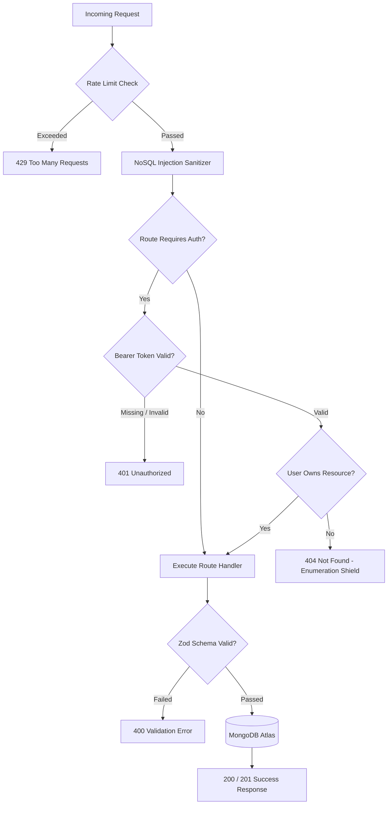

# Inkviz API Specification & Reference Documentation

**Version:** 1.0.0  
**Base URL:** `http://localhost:${PORT:-5001}` (Development — dynamic/configurable via `PORT` env) / `https://api.inkviz.app` (Production)  
**Protocol:** REST over HTTPS  
**Authentication Scheme:** Dual-token JWT (Access Token in `Authorization: Bearer <token>` + Refresh Token in `HttpOnly` Cookie)

---

## Table of Contents
1. [Global Standards & Conventions](#1-global-standards--conventions)
2. [Standard Response & Error Formats](#2-standard-response--error-formats)
3. [Complete HTTP Status Code & Error Matrix](#3-complete-http-status-code--error-matrix)
4. [Invoice Lifecycle & Business State Machine](#4-invoice-lifecycle--business-state-machine)
5. [API Endpoint Catalog](#5-api-endpoint-catalog)
   - [A. Health & System](#a-health--system)
   - [B. Authentication Module](#b-authentication-module)
   - [C. User Profile Module](#c-user-profile-module)
   - [D. Invoice Templates Module](#d-invoice-templates-module)
   - [E. Clients Module](#e-clients-module)
   - [F. Invoices Module](#f-invoices-module)
   - [G. PDF Generation Module](#g-pdf-generation-module)
   - [H. Products Module](#h-products-module)
   - [I. Expenses Module](#i-expenses-module)
   - [J. Vendors Module](#j-vendors-module)
   - [K. Quotations Module](#k-quotations-module)
6. [Security & Rate Limiting Guidelines](#6-security--rate-limiting-guidelines)

---

## 1. Global Standards & Conventions

### Request Headers
| Header | Required | Description | Example |
| :--- | :---: | :--- | :--- |
| `Content-Type` | Yes (for POST/PATCH) | Request payload format | `application/json` |
| `Authorization` | Yes (for protected routes) | Bearer access token | `Bearer eyJhbGciOi...` |
| `Cookie` | Automatic | Holds the `refreshToken` | `refreshToken=def456...` |

### General Constraints
* Request body size limit: **10 KB** (prevents memory exhaustion DOS attacks).
* Rate limits:
  * Global API: **100 requests / 15 mins / IP**
  * Auth endpoints (`/login`, `/register`, `/forgot-password`): **5 requests / 15 mins / IP**
* Soft-deleted items: Automatically purged from MongoDB after **30 days** via TTL index.

---

## 2. Standard Response & Error Formats

### Standard Success Response
```json
{
  "success": true,
  "data": {
    /* Payload object or array */
  }
}
```

### Standard Error Response
```json
{
  "success": false,
  "error": {
    "code": "VALIDATION_ERROR",
    "message": "Invalid request data",
    "fields": {
      "email": "Invalid email format",
      "password": "Password must be at least 8 characters"
    }
  }
}
```

---

## 3. Complete HTTP Status Code & Error Matrix

| HTTP Status | Error Code | Common Causes / Triggers |
| :--- | :--- | :--- |
| **`200 OK`** | *(None)* | Successful retrieval, modification, or logout. |
| **`201 Created`** | *(None)* | Successful creation of a User or Invoice. |
| **`400 Bad Request`** | `VALIDATION_ERROR` | Schema validation failure (missing required fields, malformed JSON, invalid datetimes). |
| **`400 Bad Request`** | `TRASH_EXPIRED` | Attempting to restore an invoice that was deleted over 30 days ago. |
| **`401 Unauthorized`** | `UNAUTHORIZED` | Missing `Authorization` header, invalid credentials, or missing refresh cookie. |
| **`401 Unauthorized`** | `TOKEN_EXPIRED` | Access token has exceeded its 15-minute validity period. |
| **`401 Unauthorized`** | `TOKEN_INVALID` | Signature verification failed or token has been tampered with. |
| **`403 Forbidden`** | `FORBIDDEN` | Plan limit reached (e.g., Free plan user exceeding 5 invoices/month). |
| **`404 Not Found`** | `NOT_FOUND` | Resource does not exist, or belongs to another user (ownership isolation). |
| **`409 Conflict`** | `CONFLICT` | Email address is already registered in the system. |
| **`429 Too Many Requests`** | `TOO_MANY_REQUESTS` | Rate limit threshold exceeded (e.g. brute-force login attempts). |
| **`500 Internal Error`** | `INTERNAL_ERROR` | Unhandled server exception or PDF rendering engine timeout. |
| **`503 Service Unavailable`** | `SERVICE_UNAVAILABLE` | Database is disconnected or undergoing maintenance. |

---

## 4. Invoice Lifecycle & Business State Machine

An invoice in Inkviz transitions through various states based on client actions:

```text
       ┌───────────┐  Send to Client   ┌───────────┐
       │   Draft   ├──────────────────►│   Sent    │
       └─────┬─────┘                   └─────┬─────┘
             │                               │
    Change / │                      Mark as  │
    Update   │                      Paid     │
             ▼                               ▼
       ┌───────────┐                   ┌───────────┐
       │   Draft   │                   │   Paid    │
       └─────┬─────┘                   └───────────┘
             │                               ▲
    Discard  │ Past Due                      │ Payment
   (Trash)   │ Date                          │ Received
             ▼                               │
       ┌───────────┐                   ┌─────┴─────┐
       │  Trashed  │                   │  Overdue  │
       └─────┬─────┘                   └───────────┘
             │
   Restore   │ Auto-Purge (30 Days)
   or Purge  ▼
       ┌───────────┐
       │ Permanently│
       │  Deleted  │
       └───────────┘
```

### Scenario Breakdown:
1. **Create / Draft:** User initiates an invoice (`status: "draft"`). Subtotal, discounts, tax, and final amount are auto-calculated on the backend.
2. **Change / Edit:** Updates client details, line items, colors, or notes (`PATCH /api/v1/invoices/:id`).
3. **Approve / Send:** Status is transitioned to `"sent"` (`status: "sent"`). Ready for payment.
4. **Mark as Paid:** When payment settles, status updates to `"paid"`.
5. **Overdue Notice:** If `dueDate` is passed without settlement, status becomes `"overdue"`.
6. **Discard (Soft Delete):** Invoice is moved to Trash (`DELETE /api/v1/invoices/:id`). It disappears from active views.
7. **Restore:** Within 30 days, user can recover the invoice (`POST /api/v1/invoices/:id/restore`).
8. **Permanent Deletion:** After 30 days in trash, MongoDB TTL automatically purges the document.

---

## 5. API Endpoint Catalog

---

### A. Health & System

#### 1. Server Health Check
* **Endpoint:** `GET /health`
* **Auth:** Public
* **Description:** Quick liveness probe.
* **Success Response (`200 OK`):**
  ```json
  {
    "status": "OK",
    "uptime": 142.5
  }
  ```

#### 2. Database Readiness Check
* **Endpoint:** `GET /ready`
* **Auth:** Public
* **Description:** Verifies active database connection.
* **Success Response (`200 OK`):**
  ```json
  {
    "status": "Ready"
  }
  ```
* **Error Response (`503 Service Unavailable`):**
  ```json
  {
    "status": "Not Ready"
  }
  ```

---

### B. Authentication Module

#### 1. Register User
* **Endpoint:** `POST /api/v1/auth/register`
* **Auth:** Public
* **Request Body:**
  ```json
  {
    "name": "Alex Mercer",
    "email": "alex.mercer@example.com",
    "password": "Password123!"
  }
  ```
* **Validation Rules:** `name` (>=2 chars), `email` (valid format), `password` (>=8 chars).
* **Success Response (`201 Created`):**
  ```json
  {
    "success": true,
    "data": {
      "user": {
        "_id": "66d58f...",
        "name": "Alex Mercer",
        "email": "alex.mercer@example.com"
      }
    }
  }
  ```
* **Error Possibilities:**
  * `400 Bad Request` (`VALIDATION_ERROR`): Password too short or invalid email.
  * `409 Conflict` (`CONFLICT`): `"Email is already registered"`.

---

#### 2. Login User
* **Endpoint:** `POST /api/v1/auth/login`
* **Auth:** Public
* **Request Body:**
  ```json
  {
    "email": "alex.mercer@example.com",
    "password": "Password123!"
  }
  ```
* **Success Response (`200 OK`):**
  * *Headers:* `Set-Cookie: refreshToken=...; HttpOnly; SameSite=Strict; Path=/; Max-Age=604800`
  ```json
  {
    "success": true,
    "data": {
      "user": {
        "_id": "66d58f...",
        "name": "Alex Mercer",
        "email": "alex.mercer@example.com",
        "plan": "free"
      },
      "accessToken": "eyJhbGciOiJIUzI1NiIsInR5cCI6IkpXVCJ9..."
    }
  }
  ```
* **Error Possibilities:**
  * `401 Unauthorized` (`UNAUTHORIZED`): `"Invalid credentials"`.
  * `429 Too Many Requests` (`TOO_MANY_REQUESTS`): `"Account temporarily locked due to too many failed login attempts. Please try again later."`

---

#### 3. Refresh Access Token
* **Endpoint:** `POST /api/v1/auth/refresh`
* **Auth:** Cookie-based (`refreshToken`)
* **Success Response (`200 OK`):**
  ```json
  {
    "success": true,
    "data": {
      "accessToken": "eyJhbGciOiJIUzI1NiIsInR5cCI6IkpXVCJ9..."
    }
  }
  ```
* **Error Possibilities:**
  * `401 Unauthorized` (`UNAUTHORIZED`): Missing or expired refresh token cookie.

---

#### 4. Logout User
* **Endpoint:** `POST /api/v1/auth/logout`
* **Auth:** Protected (Optional header / Cookie)
* **Success Response (`200 OK`):**
  * *Headers:* Clears `refreshToken` cookie.
  ```json
  {
    "success": true,
    "data": null
  }
  ```

---

#### 5. Forgot Password
* **Endpoint:** `POST /api/v1/auth/forgot-password`
* **Auth:** Public
* **Request Body:**
  ```json
  {
    "email": "alex.mercer@example.com"
  }
  ```
* **Success Response (`200 OK`):** *(Generic response prevents email enumeration)*
  ```json
  {
    "success": true,
    "data": {
      "message": "If that email exists, a password reset link has been sent"
    }
  }
  ```

---

#### 6. Reset Password
* **Endpoint:** `POST /api/v1/auth/reset-password`
* **Auth:** Public
* **Request Body:**
  ```json
  {
    "token": "a93f1d8c72e945...",
    "password": "NewStrongPassword123!"
  }
  ```
* **Success Response (`200 OK`):**
  ```json
  {
    "success": true,
    "data": {
      "message": "Password reset successful"
    }
  }
  ```
* **Error Possibilities:**
  * `400 Bad Request` (`BAD_REQUEST`): Token is invalid or has expired (exceeded 1-hour window).

---

### C. User Profile Module

#### 1. Get Profile
* **Endpoint:** `GET /api/v1/users/me`
* **Auth:** `Bearer <accessToken>`
* **Success Response (`200 OK`):**
  ```json
  {
    "success": true,
    "data": {
      "user": {
        "_id": "66d58f...",
        "name": "Alex Mercer",
        "email": "alex.mercer@example.com",
        "companyName": "Mercer Solutions",
        "currency": "USD",
        "plan": "free",
        "createdAt": "2026-09-02T10:00:00.000Z"
      }
    }
  }
  ```

#### 2. Update Profile
* **Endpoint:** `PATCH /api/v1/users/me`
* **Auth:** `Bearer <accessToken>`
* **Request Body:**
  ```json
  {
    "name": "Alexander Mercer",
    "companyName": "Mercer Global LLC",
    "currency": "EUR",
    "address": "456 Market St, Berlin"
  }
  ```
* **Success Response (`200 OK`):** Returns updated user object.

#### 3. Export Account Data (GDPR)
* **Endpoint:** `GET /api/v1/users/me/export`
* **Auth:** `Bearer <accessToken>`
* **Success Response (`200 OK`):** Returns full JSON archive of User profile and all active/trashed Invoices.

#### 4. Delete Account
* **Endpoint:** `DELETE /api/v1/users/me`
* **Auth:** `Bearer <accessToken>`
* **Request Body:**
  ```json
  {
    "confirm": "DELETE MY ACCOUNT"
  }
  ```
* **Success Response (`200 OK`):** Soft deletes user account and flags related invoices.

---

### D. Invoice Templates Module

#### 1. List Available Templates
* **Endpoint:** `GET /api/v1/templates`
* **Auth:** `Bearer <accessToken>`
* **Success Response (`200 OK`):**
  ```json
  {
    "success": true,
    "data": {
      "templates": [
        {
          "_id": "66d58f...",
          "name": "Classic Modern",
          "thumbnailUrl": "https://assets.inkviz.app/tpl-1.png",
          "isPremium": false
        }
      ]
    }
  }
  ```

---

### E. Clients Module

#### 1. List Clients
* **Endpoint:** `GET /api/v1/clients`
* **Auth:** `Bearer <accessToken>`
* **Query Parameters:** `search` (optional)
* **Success Response (`200 OK`):** Array of clients.

#### 2. Create Client
* **Endpoint:** `POST /api/v1/clients`
* **Auth:** `Bearer <accessToken>`
* **Success Response (`201 Created`):** Returns created client object.

#### 3. Update Client
* **Endpoint:** `PATCH /api/v1/clients/:id`
* **Auth:** `Bearer <accessToken>`
* **Success Response (`200 OK`):** Returns updated client.

#### 4. Delete Client
* **Endpoint:** `DELETE /api/v1/clients/:id`
* **Auth:** `Bearer <accessToken>`
* **Success Response (`200 OK`):** Hard deletes the client.

---

### F. Invoices Module

#### 1. List Invoices
* **Endpoint:** `GET /api/v1/invoices`
* **Auth:** `Bearer <accessToken>`
* **Query Parameters:**
  * `status` *(optional)*: `draft`, `sent`, `paid`, `overdue`
  * `page` *(optional, default: 1)*: Positive integer
  * `limit` *(optional, default: 10)*: Positive integer
* **Success Response (`200 OK`):**
  ```json
  {
    "success": true,
    "data": {
      "invoices": [
        {
          "_id": "66d590...",
          "invoiceNumber": "INV-202609-0001",
          "clientName": "Acme Corp",
          "totalAmount": 1500.00,
          "currency": "USD",
          "status": "draft",
          "issueDate": "2026-09-02T00:00:00.000Z",
          "dueDate": "2026-09-16T00:00:00.000Z"
        }
      ],
      "pagination": {
        "total": 1,
        "page": 1,
        "limit": 10,
        "totalPages": 1
      }
    }
  }
  ```

---

#### 2. Create Invoice
* **Endpoint:** `POST /api/v1/invoices`
* **Auth:** `Bearer <accessToken>`
* **Request Body:**
  ```json
  {
    "templateId": "66d58f...",
    "clientName": "Acme Corp",
    "clientEmail": "billing@acme.com",
    "clientAddress": "123 Business Way, Suite 400",
    "items": [
      {
        "description": "Full-Stack Development (Sprint 1)",
        "quantity": 40,
        "price": 100
      },
      {
        "description": "Cloud Hosting Setup",
        "quantity": 1,
        "price": 200
      }
    ],
    "taxRate": 10,
    "discountRate": 5,
    "currency": "USD",
    "issueDate": "2026-09-02T00:00:00.000Z",
    "dueDate": "2026-09-16T00:00:00.000Z",
    "notes": "Payment due within 14 days.",
    "colorScheme": "#1763B9",
    "font": "Inter"
  }
  ```
* **Calculations Performed Automatically:**
  * `subtotal` = $(40 \times 100) + (1 \times 200) = \$4200.00$
  * `discountAmount` = $5\% \text{ of } 4200 = \$210.00$
  * `taxAmount` = $10\% \text{ of } (4200 - 210) = \$399.00$
  * `totalAmount` = $(4200 - 210) + 399 = \$4389.00$
* **Success Response (`201 Created`):** Returns complete created invoice object with assigned `invoiceNumber`.
* **Error Possibilities:**
  * `400 Bad Request` (`VALIDATION_ERROR`): Missing items, negative prices, or malformed email.
  * `403 Forbidden` (`FORBIDDEN`): `"Free plan limit reached (5 invoices/month)"`.

---

#### 3. Update / Change Invoice
* **Endpoint:** `PATCH /api/v1/invoices/:id`
* **Auth:** `Bearer <accessToken>`
* **Description:** Modifies existing invoice properties (e.g. changing status to `"sent"` or `"paid"`, altering line items).
* **Request Body:**
  ```json
  {
    "status": "sent",
    "notes": "Updated: Client requested wire transfer info."
  }
  ```
* **Success Response (`200 OK`):** Returns updated invoice object.
* **Error Possibilities:**
  * `404 Not Found` (`NOT_FOUND`): Invoice not found or does not belong to the authenticated user.

---

#### 4. Discard Invoice (Soft Delete / Move to Trash)
* **Endpoint:** `DELETE /api/v1/invoices/:id`
* **Auth:** `Bearer <accessToken>`
* **Description:** Sets `isDeleted: true` and records `deletedAt`. Moves invoice to Trash.
* **Success Response (`200 OK`):**
  ```json
  {
    "success": true,
    "data": {
      "message": "Invoice moved to trash"
    }
  }
  ```

---

#### 5. List Trashed Invoices
* **Endpoint:** `GET /api/v1/invoices/trash`
* **Auth:** `Bearer <accessToken>`
* **Success Response (`200 OK`):** Returns array of all soft-deleted invoices waiting for restore or auto-purge.

---

#### 6. Restore Invoice from Trash
* **Endpoint:** `POST /api/v1/invoices/:id/restore`
* **Auth:** `Bearer <accessToken>`
* **Success Response (`200 OK`):**
  ```json
  {
    "success": true,
    "data": {
      "message": "Invoice restored"
    }
  }
  ```
* **Error Possibilities:**
  * `400 Bad Request` (`TRASH_EXPIRED`): `"Invoice permanently deleted (trash expired)"` (exceeded 30-day window).
  * `404 Not Found` (`NOT_FOUND`): Invoice not found in trash.

---

#### 7. Duplicate Invoice
* **Endpoint:** `POST /api/v1/invoices/:id/duplicate`
* **Auth:** `Bearer <accessToken>`
* **Description:** Creates a new draft invoice with copied data but a new invoice number and dates.
* **Success Response (`201 Created`):** Returns duplicated invoice.

---

#### 8. Generate Share Link
* **Endpoint:** `POST /api/v1/invoices/:id/share`
* **Auth:** `Bearer <accessToken>`
* **Description:** Generates or retrieves a unique `shareToken` for public viewing.
* **Success Response (`200 OK`):** Returns `{ "shareToken": "uuid" }`.

---

#### 9. Get Public Invoice
* **Endpoint:** `GET /api/v1/share/:token`
* **Auth:** Public
* **Description:** Retrieves invoice for client-facing view.
* **Success Response (`200 OK`):** Returns public invoice data.

---

### G. PDF Generation Module

#### 1. Download Rendered Invoice PDF
* **Endpoint:** `GET /api/v1/invoices/:id/download`
* **Auth:** `Bearer <accessToken>`
* **Response Headers:**
  * `Content-Type: application/pdf`
  * `Content-Disposition: attachment; filename="invoice-<id>.pdf"`
* **Success Response (`200 OK`):** Binary PDF Stream rendered via Puppeteer.
* **Error Possibilities:**
  * `401 Unauthorized` (`UNAUTHORIZED`): Missing or invalid auth token.
  * `404 Not Found` (`NOT_FOUND`): Invoice does not exist or unauthorized.
  * `500 Internal Error` (`INTERNAL_ERROR`): Headless browser rendering failure.

---

#### 2. Download Public Invoice PDF
* **Endpoint:** `GET /api/v1/share/:token/download`
* **Auth:** Public
* **Response Headers:** `Content-Type: application/pdf`
* **Success Response (`200 OK`):** Binary PDF Stream.

---


## 6. Security & Rate Limiting Guidelines



1. **Information Enumeration Shield:** Any attempt to read or modify a resource owned by another user yields `404 Not Found` instead of `403 Forbidden` to prevent malicious attackers from probing valid resource IDs.
2. **Dual-Token Storage:** `refreshToken` is never accessible via JavaScript (`HttpOnly: true`), securing sessions against Cross-Site Scripting (XSS).
3. **Zod Parsing:** All payloads are validated before reaching controller/service logic, ensuring zero unhandled database cast exceptions.
4. **Rate Limits:** Production: 100 req/15 min/IP globally. Development/test: 2000 req/15 min/IP to facilitate automated test suites.

---

## H. Products Module

**Base:** `/api/v1/products` | Auth: Bearer token required on all routes.

| Method | Endpoint | Description | Status |
|:---|:---|:---|:---|
| GET | `/products` | List all products (with optional `?search=&type=`) | 200 |
| POST | `/products` | Create product | 201 |
| GET | `/products/:id` | Get single product | 200/404 |
| PATCH | `/products/:id` | Update product details | 200/404 |
| POST | `/products/:id/stock` | Adjust stock `{ adjustment: number }` | 200/404 |
| DELETE | `/products/:id` | Hard delete product | 200/404 |

**Create Body:** `{ name, sku?, type?, sellingPrice, purchaseCost?, unit?, taxRate?, stock?, lowStockThreshold? }`  
**Response shape:** `{ success: true, data: { product: { _id, name, sku, type, sellingPrice, stock, ... } } }`

---

## I. Expenses Module

**Base:** `/api/v1/expenses` | Auth: Bearer token required on all routes.

| Method | Endpoint | Description | Status |
|:---|:---|:---|:---|
| GET | `/expenses` | List all expenses (with optional `?category=&search=`) | 200 |
| POST | `/expenses` | Create expense | 201 |
| GET | `/expenses/:id` | Get single expense | 200/404 |
| PATCH | `/expenses/:id` | Update expense | 200/404 |
| DELETE | `/expenses/:id` | Hard delete expense | 200/404 |

**Create Body:** `{ title, category, amount, date (YYYY-MM-DD), paymentMethod, taxDeductible?, taxAmount?, notes? }`  
**Response shape:** `{ success: true, data: { expense: { _id, expenseNumber, title, amount, ... } } }`

---

## J. Vendors Module

**Base:** `/api/v1/vendors` | Auth: Bearer token required on all routes.

| Method | Endpoint | Description | Status |
|:---|:---|:---|:---|
| GET | `/vendors` | List all vendors (with optional `?search=&category=&status=`) | 200 |
| POST | `/vendors` | Create vendor | 201 |
| GET | `/vendors/:id` | Get single vendor | 200/404 |
| PATCH | `/vendors/:id` | Update vendor | 200/404 |
| DELETE | `/vendors/:id` | Hard delete vendor | 200/404 |

**Create Body:** `{ name, email?, phone?, category?, gstin?, address?, paymentTerms? }`  
**Response shape:** `{ success: true, data: { vendor: { _id, name, email, status, ... } } }`

---

## K. Quotations Module

**Base:** `/api/v1/quotations` | Auth: Bearer token required on all routes.

| Method | Endpoint | Description | Status |
|:---|:---|:---|:---|
| GET | `/quotations` | List all quotations (with optional `?search=&status=`) | 200 |
| POST | `/quotations` | Create quotation | 201 |
| GET | `/quotations/:id` | Get single quotation | 200/404 |
| PATCH | `/quotations/:id` | Update quotation | 200/404 |
| POST | `/quotations/:id/convert` | Convert quotation to invoice | 200/404 |
| DELETE | `/quotations/:id` | Hard delete quotation | 200/404 |

**Create Body:**
```json
{
  "clientName": "string (required)",
  "clientEmail": "email (required)",
  "date": "YYYY-MM-DD (required)",
  "expiryDate": "YYYY-MM-DD (required)",
  "items": [{ "description": "string", "quantity": number, "rate": number, "amount": number }],
  "subtotal": number,
  "taxAmount": number,
  "total": number,
  "status": "Draft|Sent|Accepted|Declined|Expired",
  "notes": "string?"
}
```
**Response shape:** `{ success: true, data: { quotation: { _id, clientName, status, total, ... } } }`

